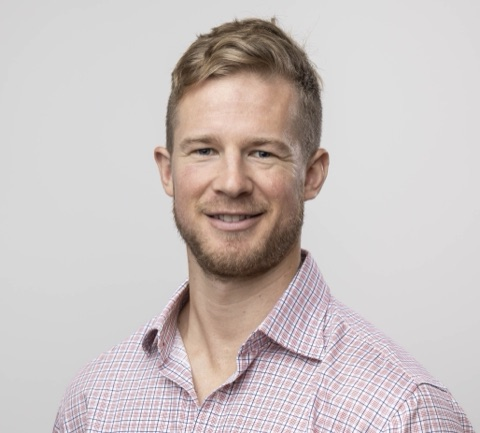

:::::::::::::: {.wrap .cv}
::::: cv-head
```{=html}

```

::: cv-head-text
```{=html}
<h1>Mitch Henderson</h1>
```

Data science for better decisions in sport.
:::

[<i class="bi bi-file-earmark-arrow-down" aria-hidden="true"></i> Download resume (PDF)](https://drive.google.com/uc?export=download&id=1a5qqr7yBhxUemN35BaE8nMW9mcFiXsBL){.btn-solid .cv-print}
:::::

::: cv-contact
[[mitchhenderson.dev](https://www.mitchhenderson.dev) ·]{.cv-print-only} [LinkedIn](https://www.linkedin.com/in/mitchjameshenderson/) · [GitHub](https://github.com/mitchhenderson) · [Bluesky](https://bsky.app/profile/mitchhenderson.bsky.social)
:::

::: cv-summary
I spent seven years working directly with athletes and coaches in professional rugby union and league, across sport science and strength and conditioning roles up to Olympic level. A big part of that work was figuring out what coaches actually needed to know, then turning data into something they could use to make a decision.

I now bring that experience to data science. I use statistical modelling and simulation to understand uncertainty and help with difficult decisions. I'm working towards tools that can handle the complexity underneath without putting that complexity on the person making the decision.
:::

## Experience {.section-title .unnumbered .unlisted}


:::: {#role-nswhp .cv-entry}
::: cv-dates
2023 – present
:::

::: cv-body
### NSW Health Pathology {.unnumbered .unlisted}

**Senior Data Scientist** [May 2024 – present]{.cv-when}\
**Data Scientist** [Oct 2023 – May 2024]{.cv-when}

Data extraction, curation and analysis, and communicating the findings to executive stakeholders across the organisation.
:::
::::

:::: {#role-afsa .cv-entry}
::: cv-dates
2022 – 2023
:::

::: cv-body
### Australian Financial Security Authority {.unnumbered .unlisted}

**Senior Business Insights Analyst** [Oct 2022 – Oct 2023]{.cv-when}

Information and insights for the agency through data extraction, enrichment, visualisation and reporting.
:::
::::

:::: {#role-waratahs .cv-entry}
::: cv-dates
2022
:::

::: cv-body
### NSW Waratahs {.unnumbered .unlisted}

**Sports Scientist** [Apr 2022 – Oct 2022]{.cv-when}

Turning data into knowledge to support decision-making in the high performance department.
:::
::::

:::: {#role-rugbyau .cv-entry}
::: cv-dates
2016 – 2022
:::

::: cv-body
### Rugby Australia {.unnumbered .unlisted}

**Head of Athletic Performance, Men's Sevens** [Sep 2021 – Apr 2022]{.cv-when}\
**Athletic Performance Coach, Sevens and National Referees** [Feb 2020 – Sep 2021]{.cv-when}\
**Sports Performance Scientist, Women's Sevens** [Jul 2018 – Feb 2020]{.cv-when}\
**Assistant Strength and Conditioning Coach, Men's Sevens** [Aug 2016 – Jul 2018]{.cv-when}

Led the development, planning and delivery of the athletic performance programme for the national men's sevens squad, after earlier roles providing performance coaching and sport science services to the national sevens teams and elite referees.
:::
::::

:::: {#role-tigers .cv-entry}
::: cv-dates
2015 – 2016
:::

::: cv-body
### Wests Tigers {.unnumbered .unlisted}

**Physical Performance Assistant** [Apr 2016 – Aug 2016]{.cv-when}\
**Sports Science and Strength and Conditioning Intern** [Nov 2015 – Apr 2016]{.cv-when}
:::
::::

## Education {.section-title .unnumbered .unlisted}

:::: {#role-phd .cv-entry}
::: cv-dates
2018 – 2023
:::

::: cv-body
### PhD, Sport and Exercise Science {.unnumbered .unlisted}

University of Technology Sydney. Supervised by Dist. Prof. Aaron Coutts.

Practical strategies for female rugby sevens athletes to maximise performance and health in hot and humid competition conditions.
:::
::::

:::: {#role-bsc .cv-entry}
::: cv-dates
2013 – 2017
:::

::: cv-body
### Bachelor of Sport and Exercise Science (Honours) {.unnumbered .unlisted}

University of Technology Sydney.

**Honours** [2017]{.cv-when}\
**Bachelor's degree** [2013 – 2016]{.cv-when}

Honours research on contextual factors affecting elite men's rugby sevens performance.
:::
::::

## Skills {.section-title .unnumbered .unlisted}

:::: cv-entry
::: cv-dates
Methods
:::

::: cv-body
Bayesian and multilevel modelling, probabilistic forecasting, Monte Carlo simulation, statistical machine learning.
:::
::::

:::: cv-entry
::: cv-dates
Tools
:::

::: cv-body
R, Python and SQL. Bayesian modelling with Stan and brms; reproducible reporting with Quarto; visualisation with ggplot2 and gt.
:::
::::

:::: cv-entry
::: cv-dates
Domain
:::

::: cv-body
Seven years in professional sport working directly with athletes, coaches and performance staff across sport science, strength and conditioning, athlete monitoring and player tracking data.
:::
::::

## Research {.section-title .unnumbered .unlisted}

::: section-intro
My published research is in sport science, not data science. It comes from work with elite rugby sevens athletes in training and competition. Selected first-author papers:
:::

::: cv-papers
-   Core Body Temperatures in Intermittent Sports: A Systematic Review. *Sports Medicine*, 2023.
-   Responses to a 5-day sport-specific heat acclimatization camp in elite female rugby sevens athletes. *International Journal of Sports Physiology and Performance*, 2022.
-   Changes in core temperature during an elite female rugby sevens tournament. *International Journal of Sports Physiology and Performance*, 2020.
-   Individual factors affecting rugby sevens match performance. *International Journal of Sports Physiology and Performance*, 2019.
-   Rugby sevens match demands and measurement of performance: a review. *Kinesiology*, 2018.

[Full list on Google Scholar](https://scholar.google.com/citations?user=AUWu1tMAAAAJ){.text-link}
:::
::::::::::::::
