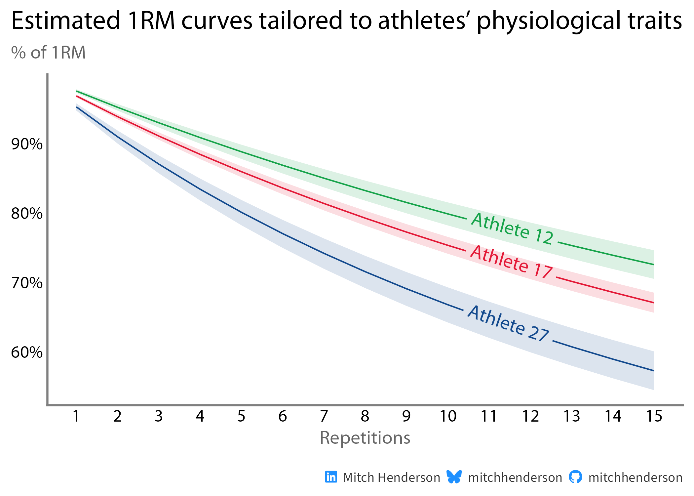
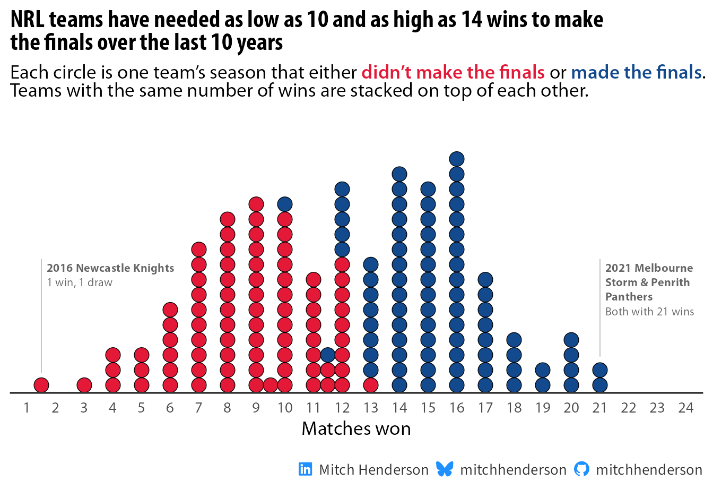

```{=html}
<!-- The page is written as HTML so the markup is exactly what the theme
     styles: Pandoc would wrap images and headings in extra elements.
     Links therefore point at the built .html pages. -->
<div class="wrap home">

  <section class="hero" aria-labelledby="hero-title">
    <div class="hero-text">
      <h1 id="hero-title" class="hero-title">Data science for better decisions in sport.</h1>
      <p class="hero-lead">I spent seven years working directly with athletes and coaches in professional rugby. I now work as a data scientist, using statistical modelling and simulation to tackle the kinds of problems coaches, managers and administrators face.</p>
      <p class="hero-detail">I’m working towards decision-support tools that can handle complexity underneath without putting that complexity on the person making the decision.</p>
      <p class="hero-detail">Here I share the work in plain language, along with the data and code (usually in both R and Python).</p>
      <div class="hero-actions">
        <a class="btn-solid" href="posts.html">Read the posts</a>
        <a class="btn-ghost" href="about.html">About and experience</a>
      </div>
      <ul class="hero-links" aria-label="Elsewhere">
        <li><a href="https://www.linkedin.com/in/mitchjameshenderson/"><i class="bi bi-linkedin" aria-hidden="true"></i> LinkedIn</a></li>
        <li><a href="https://github.com/mitchhenderson"><i class="bi bi-github" aria-hidden="true"></i> GitHub</a></li>
        <li><a href="https://bsky.app/profile/mitchhenderson.bsky.social"><i class="bi bi-bluesky" aria-hidden="true"></i> Bluesky</a></li>
      </ul>
    </div>
    
  </section>

  <section aria-labelledby="work-title">
    <h2 id="work-title" class="section-title">Selected work</h2>

    <article class="feature">
      <div class="feature-figure">
        
      </div>
      <div class="feature-body">
        <h3><a href="posts/2026-01-04-e1rm-modelling/index.html">Making 1 rep max estimates more accurate and honest</a></h3>
        <p>Standard formulas treat every athlete the same and give a single number. This model learns each athlete’s strength profile from their training history and says how confident it is in the estimate.</p>
        <ul class="tags" aria-label="Methods and languages">
          <li class="tag">Bayesian multilevel model</li>
          <li class="tag">R</li>
          <li class="tag">Python</li>
        </ul>
        <p class="feature-more" aria-hidden="true">Read the analysis <i class="bi bi-arrow-right"></i></p>
      </div>
    </article>

    <article class="feature">
      <div class="feature-figure">
        
      </div>
      <div class="feature-body">
        <h3><a href="posts/2025-01-18-how-many-wins-do-nrl-teams-need-to-make-the-finals/index.html">How many wins do NRL teams need to make the finals?</a></h3>
        <p>Probably 13. Ten thousand simulated seasons show why the finals cut-off moves from year to year, and how likely a team is to qualify at each win total.</p>
        <ul class="tags" aria-label="Methods and languages">
          <li class="tag">Monte Carlo simulation</li>
          <li class="tag">R</li>
          <li class="tag">Python</li>
        </ul>
        <p class="feature-more" aria-hidden="true">Read the analysis <i class="bi bi-arrow-right"></i></p>
      </div>
    </article>
  </section>

  <section aria-labelledby="focus-title">
    <h2 id="focus-title" class="section-title">What I work on</h2>
    <div class="focus">
      <div class="focus-item">
        <h3>Statistical modelling</h3>
        <p>Build models that capture the important parts of the problem and quantify what we know and what we don’t.</p>
        <p class="tools">Bayesian and multilevel models · Stan, brms</p>
      </div>
      <div class="focus-item">
        <h3>Simulation and decision support</h3>
        <p>Use models and simulation to explore what could happen, compare options, and understand the consequences of different decisions.</p>
        <p class="tools">Monte Carlo methods · probabilistic forecasting</p>
      </div>
      <div class="focus-item">
        <h3>Making it useful</h3>
        <p>Turn the complexity underneath into results and tools that are clear and useful for the people making the decisions.</p>
        <p class="tools">Visualisation · interactive tools · technical communication</p>
      </div>
    </div>
    <p class="focus-note">Day to day I work in R, Python and SQL.</p>
  </section>

  <section aria-labelledby="earlier-title">
    <h2 id="earlier-title" class="section-title">Earlier writing</h2>
    <p class="earlier">Tutorials from 2020 and 2021 on working with GPS and wearable data in R are kept in the <a class="text-link" href="posts.html#earlier-writing">archive</a>.</p>
  </section>

</div>
```
